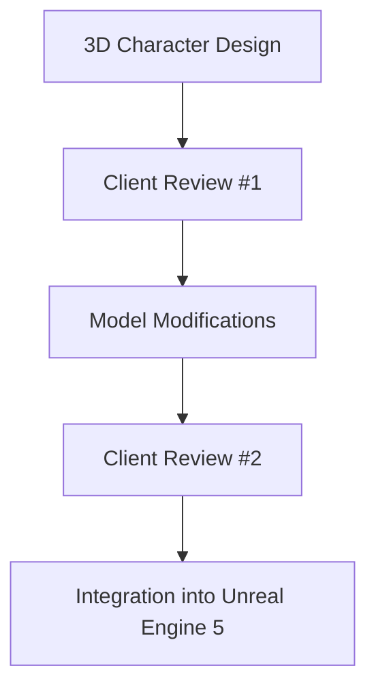

# 3D Character Creation Workflow

This workflow illustrates the key stages involved in creating 3D characters, from initial design to final integration into Unreal Engine.

```mermaid
flowchart TD
    A[3D Character Design] --> B[Client Review #1]
    B --> C[Model Modifications]
    C --> D[Client Review #2]
    D --> E[Integration into Unreal Engine 5]
```
