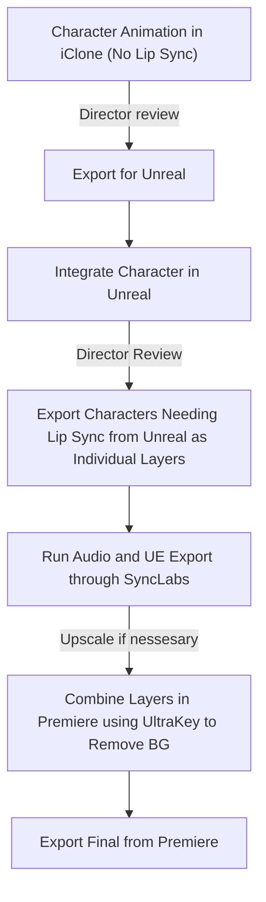

```mermaid
flowchart TD
    node1["Character Animation in iClone (No Lip Sync)"]
    node3["Export for Unreal"]
    node4["Integrate Character in Unreal"]
    node6["Export Characters Needing Lip Sync from Unreal as Individual Layers"]
    node7["Run Audio and UE Export through SyncLabs"]
    node8["Combine Layers in Premiere using UltraKey to Remove BG"]
    node9["Export Final from Premiere"]

    node1 --Director review--> node3
    node3 --> node4
    node4 --Director Review --> node6
    node6 --> node7
    node7 --Upscale if nessesary--> node8
    node8 --> node9
```

Free alternatives which need development:
LivePortrait with Face fix and upscale in Stable Diffusion 
wave-to-face with face fixes and upscale in Stable Diffusion 
