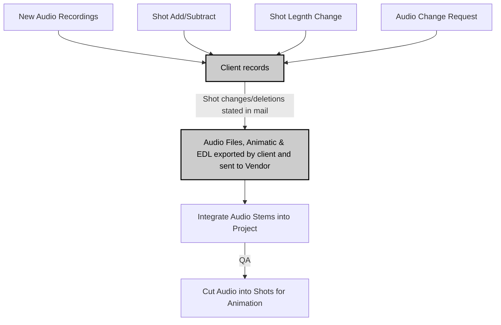

```mermaid
flowchart TD
    node0["New Audio Recordings"]
    node0a["Shot Add/Subtract"]
    node0b["Shot Legnth Change"]
    node1["Audio Change Request"]
    node2["Client records"]
    node3["Audio Files, Animatic & EDL exported by client and sent to Vendor"]
    node4["Integrate Audio Stems into Project"]
    node5["Cut Audio into Shots for Animation"]

    node0 --> node2
    node0a --> node2
    node0b --> node2
    node1 --> node2
    node2 --Shot changes/deletions stated in mail --> node3
    node3 --> node4
    node4 -- QA--> node5

    classDef note fill:#ccc,stroke:#000,stroke-width:2px,color:#000;
    class node2,node3 note;

```