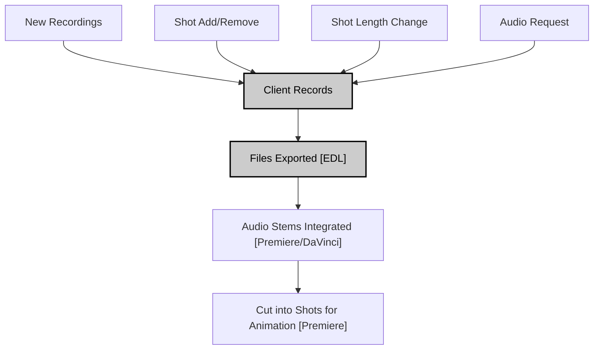

```mermaid
flowchart TD
    node0["New Recordings"]
    node0a["Shot Add/Remove"]
    node0b["Shot Length Change"]
    node1["Audio Request"]
    node2["Client Records"]
    node3["Files Exported [EDL]"]
    node4["Audio Stems Integrated [Premiere/DaVinci]"]
    node5["Cut into Shots for Animation [Premiere]"]

    node0 --> node2
    node0a --> node2
    node0b --> node2
    node1 --> node2
    node2 --> node3
    node3 --> node4
    node4 --> node5


    classDef note fill:#ccc,stroke:#000,stroke-width:2px,color:#000;
    class node2,node3 note;

```