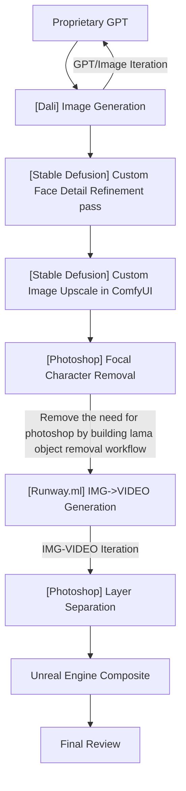
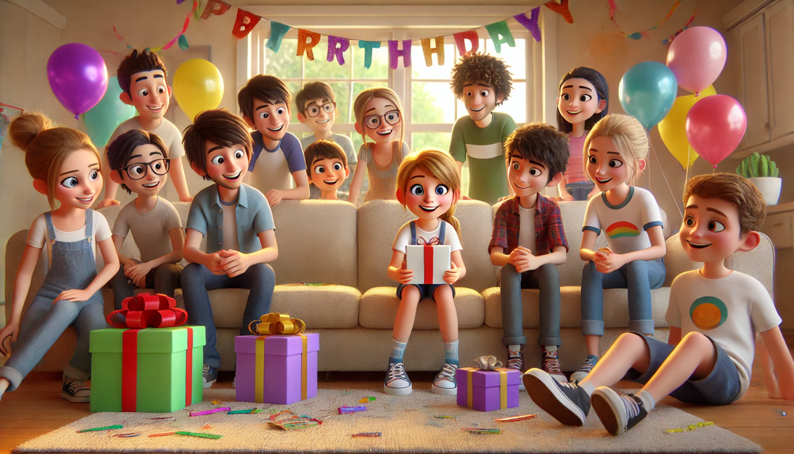
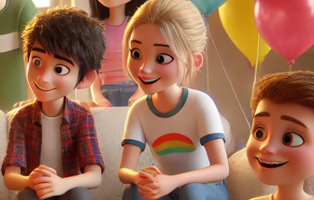
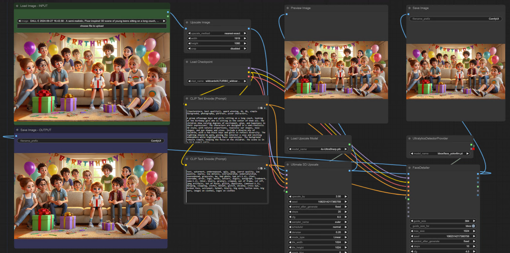
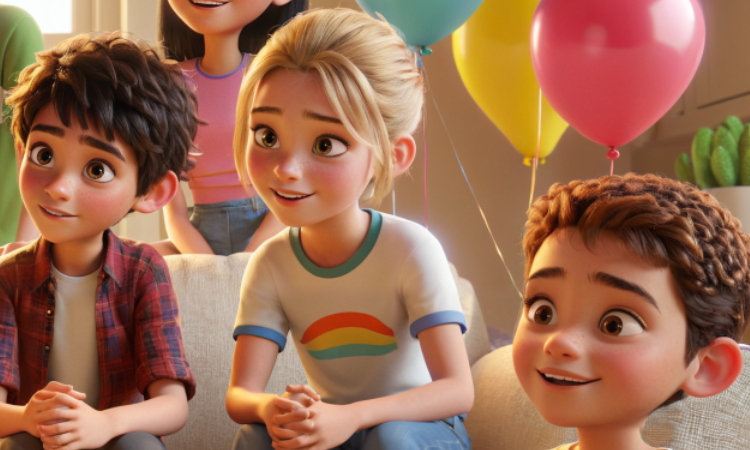
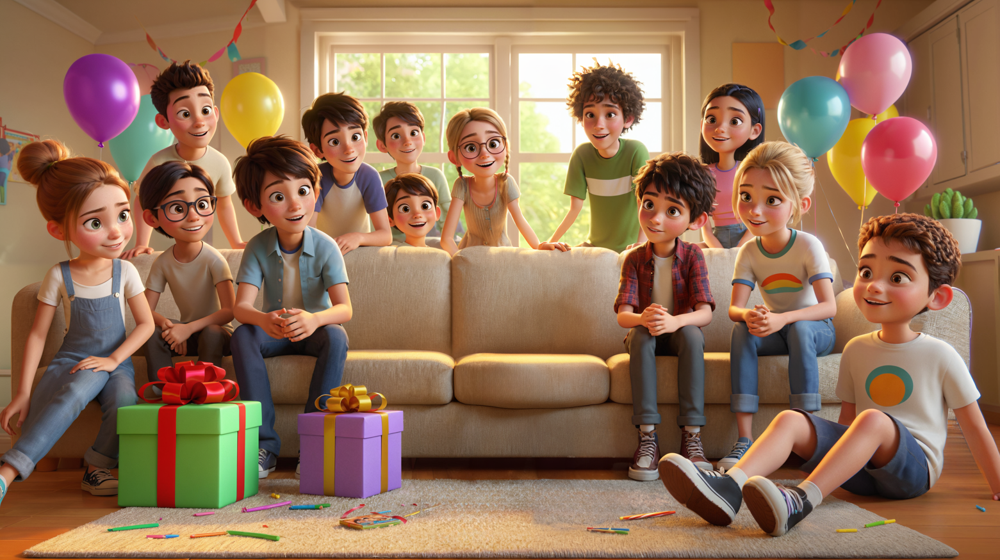

Original image generation 

Issues with image

ComfyUI Upscale and Facefix Workflow

Output of ComfyUI Workflow 

Photoshop Beta Character removal (to give space for 3d character integration)

