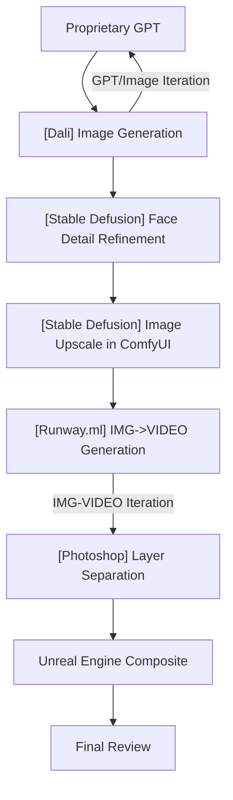

```mermaid
flowchart TD
    node1["Proprietary GPT"]
    node2["[Dali] Image Generation"]
    node4["[Stable Defusion] Face Detail Refinement"]
    node5["[Stable Defusion] Image Upscale in ComfyUI"]
    node6["[Runway.ml] IMG->VIDEO Generation"]
    node7["[Photoshop] Layer Separation"]
    node8["Unreal Engine Composite"]
    node9["Final Review"]

    node1 --> node2
    node2 -- GPT/Image Iteration--> node1
    node2 --> node4
    node4 --> node5
    node5 --> node6
    node6 --IMG-VIDEO Iteration --> node7
    node7 --> node8
    node8 --> node9

```