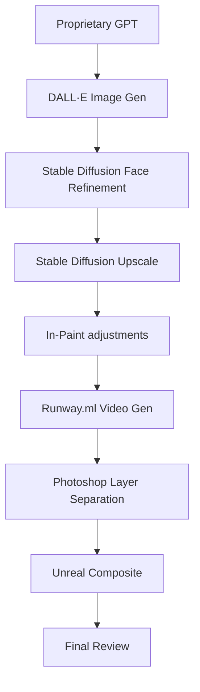

```mermaid
flowchart TD
    node1["Proprietary GPT"]
    node2["DALL·E Image Gen"]
    node2a["In-Paint adjustments"]
    node4["Stable Diffusion Face Refinement"]
    node5["Stable Diffusion Upscale"]
    node6["Runway.ml Video Gen"]
    node7["Photoshop Layer Separation"]
    node8["Unreal Composite"]
    node9["Final Review"]

    node1 --> node2
    node2 --> node4
    node4 --> node5
    node5 --> node2a
    node2a --> node6
    node6 --> node7
    node7 --> node8
    node8 --> node9

```
Original image generation 

Issues with image

ComfyUI Upscale and Facefix Workflow

Output of ComfyUI Workflow 

Photoshop Beta Character removal (to give space for 3d character integration)

