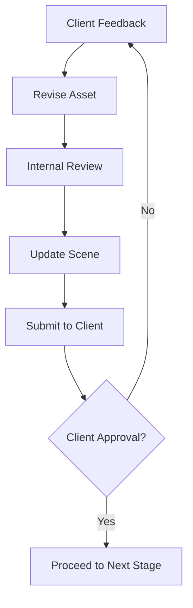

# Client Feedback Process

This process highlights how client feedback is managed throughout the production stages.

```mermaid
flowchart TD
    A[Client Feedback] --> B[Revise Asset]
    B --> C[Internal Review]
    C --> D[Update Scene]
    D --> E[Submit to Client]
    E --> F{Client Approval?}
    F -- Yes --> G[Proceed to Next Stage]
    F -- No --> A[Client Feedback]
```
