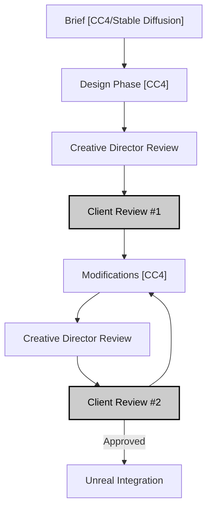

# 3D Character Creation Workflow

This workflow illustrates the key stages involved in creating 3D characters.
From initial design - Unreal Engine 5 Integration 

```mermaid
flowchart TD
    node0["Brief [CC4/Stable Diffusion]"]
    node1["Design Phase [CC4]"]
    node1a["Creative Director Review"]
    node2["Client Review #1"]
    node3["Modifications [CC4]"]
    node3a["Creative Director Review"]
    node4["Client Review #2"]
    node5["Unreal Integration"]

    node0 --> node1
    node1 --> node1a
    node1a --> node2 
    node2 --> node3
    node3 --> node3a
    node3a --> node4 
    node4 --Approved--> node5
    node4 --> node3


    classDef note fill:#ccc,stroke:#000,stroke-width:2px,color:#000;
    class node2,node4 note;
```
