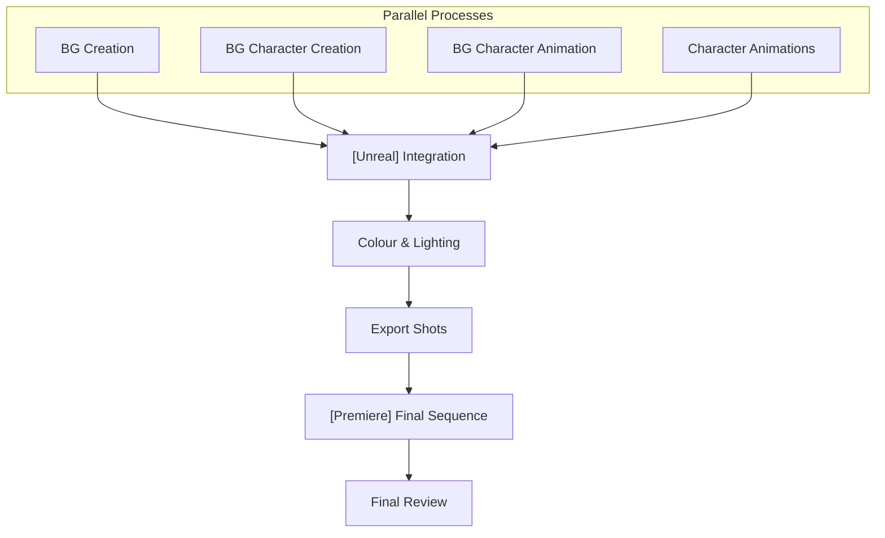

```mermaid
flowchart TD
    subgraph Parallel Processes
        node1["BG Creation"]
        node2["BG Character Creation"]
        node3["BG Character Animation"]
        node4["Character Animations"]
    end

    node5["[Unreal] Integration"]
    node6["Colour & Lighting"]
    node7["Export Shots"]
    node9["[Premiere] Final Sequence"]
    node10["Final Review"]

    node1 --> node5
    node2 --> node5
    node3 --> node5
    node4 --> node5
    node5 --> node6
    node6 --> node7
    node7 --> node9
    node9 --> node10


```