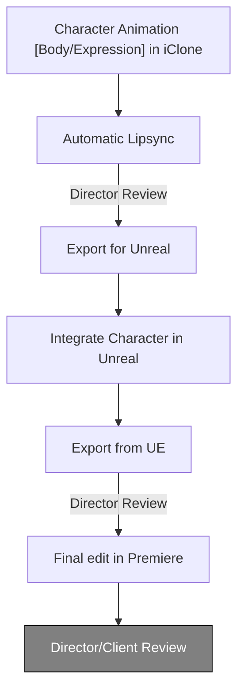

Free alternatives which need development:
LivePortrait with Face fix and upscale in Stable Diffusion 
wave-to-face with face fixes and upscale in Stable Diffusion 

Gen AI is like throwing the dice, we are constantly working on ways to improve out pipeline so our results are less random and directable 