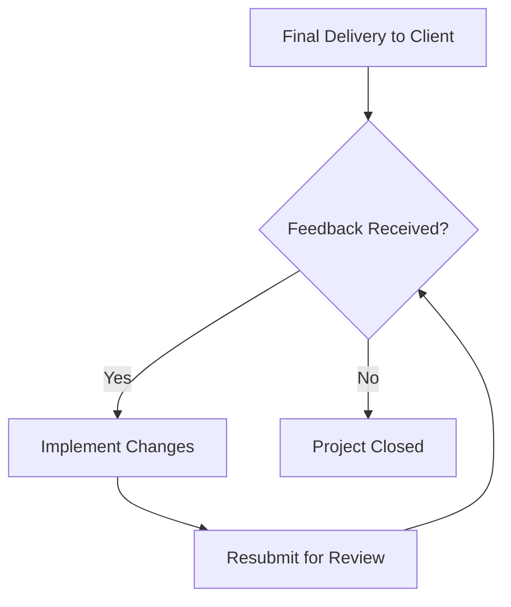

# Final Delivery Process

This diagram outlines the final feedback and delivery loop, ensuring the finished product meets all client requirements before the project is closed.

```mermaid
flowchart TD
    A[Final Delivery to Client] --> B{Feedback Received?}
    B -- Yes --> C[Implement Changes]
    C --> D[Resubmit for Review]
    B -- No --> E[Project Closed]
    D --> B
```
