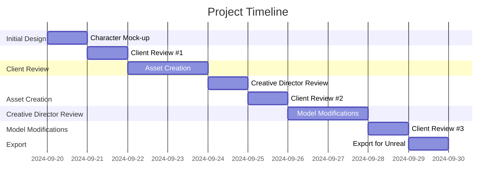

# Project Gantt Chart

This Gantt chart shows the timeline for the entire project, highlighting key stages such as character creation, asset development, and final integration.

```mermaid
gantt
    dateFormat  YYYY-MM-DD
    title Project Timeline
    
    section Initial Design
    Character Mock-up                 :a1, 2024-09-20, 1d
    
    section Client Review
    Client Review #1                  :a2, after a1, 1d
    
    section Asset Creation
    Asset Creation                    :a3, after a2, 2d
    
    section Creative Director Review
    Creative Director Review           :a4, after a3, 1d
    
    section Client Review
    Client Review #2                  :a5, after a4, 1d
    
    section Model Modifications
    Model Modifications               :a6, after a5, 2d
    
    section Client Review
    Client Review #3                  :a7, after a6, 1d
    
    section Export
    Export for Unreal                 :a8, after a7, 0.5d

```
