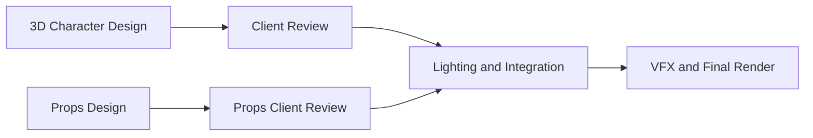

# Parallel Workflow: Assets and Props

This diagram shows the parallel workflow for creating 3D assets and props alongside character design and integration into the production pipeline.

```mermaid
flowchart LR
    A[3D Character Design] --> B[Client Review]
    A2[Props Design] --> B2[Props Client Review]
    B --> C[Lighting and Integration]
    B2 --> C
    C --> D[VFX and Final Render]
```
