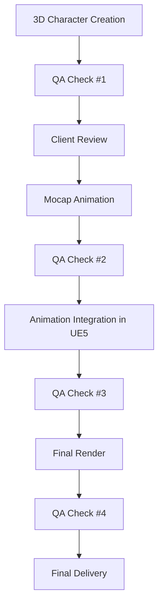

# Quality Assurance Checkpoints

This flowchart illustrates the quality assurance checkpoints throughout the 3D animation production process.

```mermaid
flowchart TD
    A[3D Character Creation] --> B[QA Check #1]
    B --> C[Client Review]
    C --> D[Mocap Animation]
    D --> E[QA Check #2]
    E --> F[Animation Integration in UE5]
    F --> G[QA Check #3]
    G --> H[Final Render]
    H --> I[QA Check #4]
    I --> J[Final Delivery]
```
