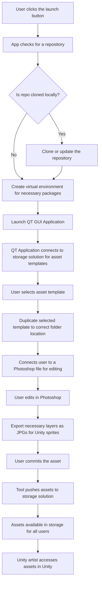
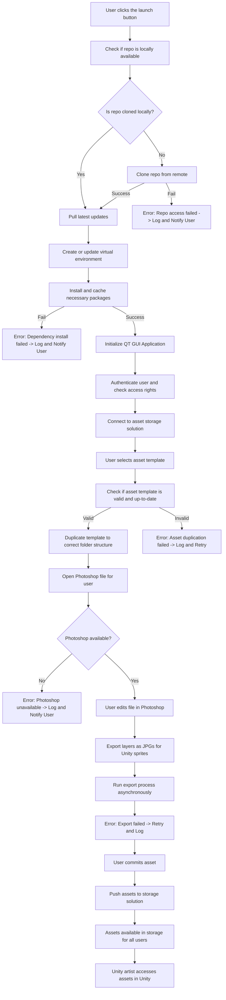

```mermaid
flowchart TD
    A[User clicks the launch button]
    B[App checks for a repository]
    C{Is repo cloned locally?}
    D[Clone or update the repository]
    E[Create virtual environment for necessary packages]
    F[Launch QT GUI Application]
    G[QT Application connects to storage solution for asset templates]
    H[User selects asset template]
    I[Duplicate selected template to correct folder location]
    J[Connects user to a Photoshop file for editing]
    K[User edits in Photoshop]
    L[Export necessary layers as JPGs for Unity sprites]
    M[User commits the asset]
    N[Tool pushes assets to storage solution]
    O[Assets available in storage for all users]
    P[Unity artist accesses assets in Unity]

    %% Flow
    A --> B
    B --> C
    C -- Yes --> D
    C -- No --> E
    D --> E
    E --> F
    F --> G
    G --> H
    H --> I
    I --> J
    J --> K
    K --> L
    L --> M
    M --> N
    N --> O
    O --> P

```

```mermaid
flowchart TD
    %% User initiates
    A[User clicks the launch button]
    
    %% Repo Handling
    B[Check if repo is locally available]
    C{Is repo cloned locally?}
    D[Clone repo from remote]
    E[Pull latest updates]
    F[Error: Repo access failed -> Log and Notify User]

    %% Virtual Environment Setup
    G[Create or update virtual environment]
    H[Install and cache necessary packages]
    I[Error: Dependency install failed -> Log and Notify User]

    %% Launching GUI Application
    J[Initialize QT GUI Application]
    K[Authenticate user and check access rights]
    L[Connect to asset storage solution]
    
    %% Asset Selection and Duplication
    M[User selects asset template]
    N[Check if asset template is valid and up-to-date]
    O[Duplicate template to correct folder structure]
    P[Error: Asset duplication failed -> Log and Retry]
    
    %% Photoshop Integration
    Q[Open Photoshop file for user]
    R{Photoshop available?}
    S[Error: Photoshop unavailable -> Log and Notify User]
    T[User edits file in Photoshop]
    
    %% Exporting Process
    U[Export layers as JPGs for Unity sprites]
    V[Run export process asynchronously]
    W[Error: Export failed -> Retry and Log]

    %% Final Commit and Push
    X[User commits asset]
    Y[Push assets to storage solution]
    Z[Assets available in storage for all users]
    AA[Unity artist accesses assets in Unity]

    %% Flow
    A --> B
    B --> C
    C -- Yes --> E
    C -- No --> D
    D --> |Success| E
    D --> |Fail| F
    E --> G
    G --> H
    H --> |Fail| I
    H --> |Success| J
    J --> K
    K --> L
    L --> M
    M --> N
    N --> |Invalid| P
    N --> |Valid| O
    O --> Q
    Q --> R
    R -- Yes --> T
    R -- No --> S
    T --> U
    U --> V
    V --> W
    W --> X
    X --> Y
    Y --> Z
    Z --> AA
```