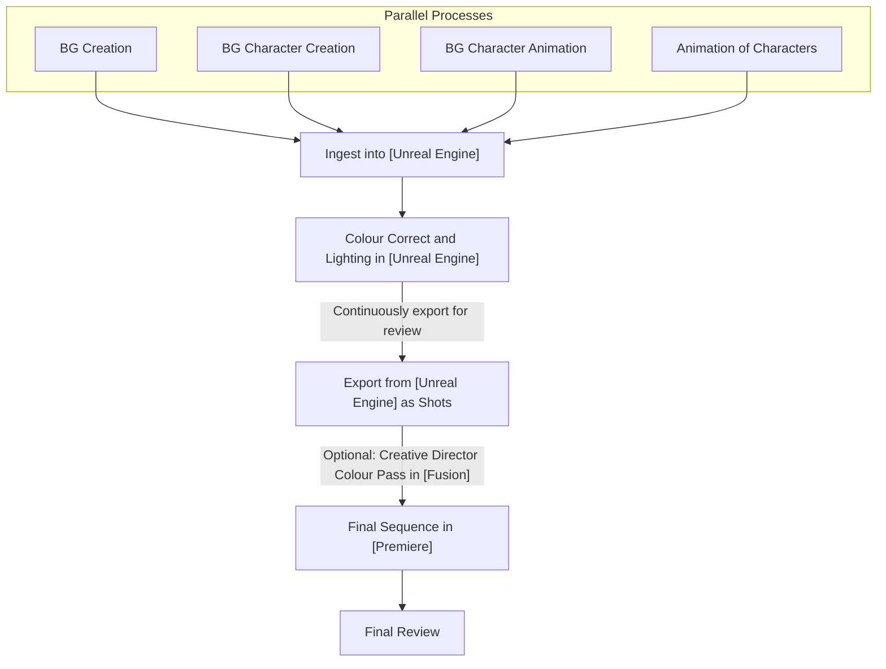

```mermaid
flowchart TD
    subgraph Parallel Processes
        node1["BG Creation"]
        node2["BG Character Creation"]
        node3["BG Character Animation"]
        node4["Animation of Characters"]
    end

    node5["Ingest into [Unreal Engine]"]
    node6["Colour Correct and Lighting in [Unreal Engine]"]
    node7["Export from [Unreal Engine] as Shots"]
    node9["Final Sequence in [Premiere]"]
    node10["Final Review"]

    node1 --> node5
    node2 --> node5
    node3 --> node5
    node4 --> node5
    node5 --> node6
    node6 --Continuously export for review--> node7
    node7 --Optional: Creative Director Colour Pass in [Fusion]--> node9
    node9 --> node10


```